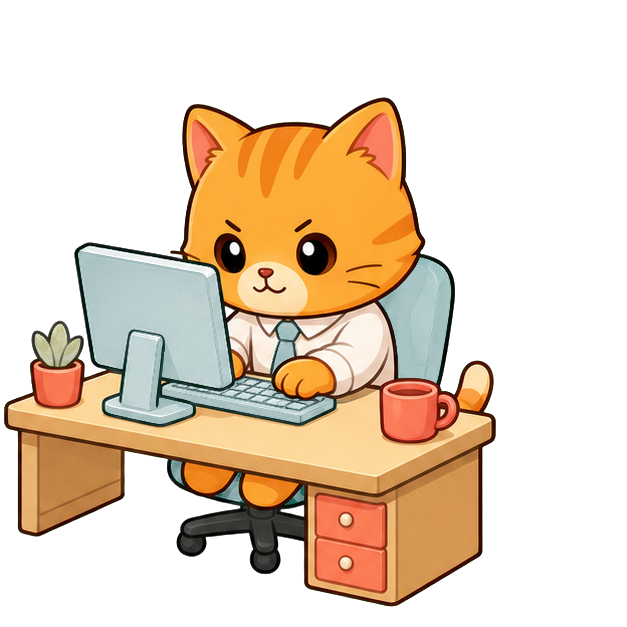
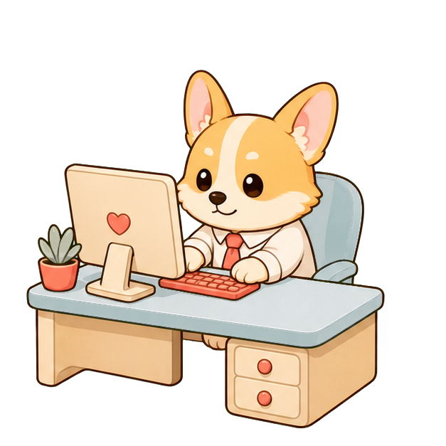
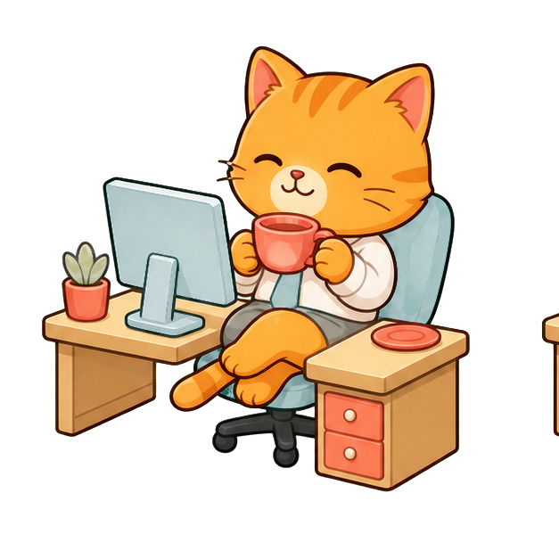
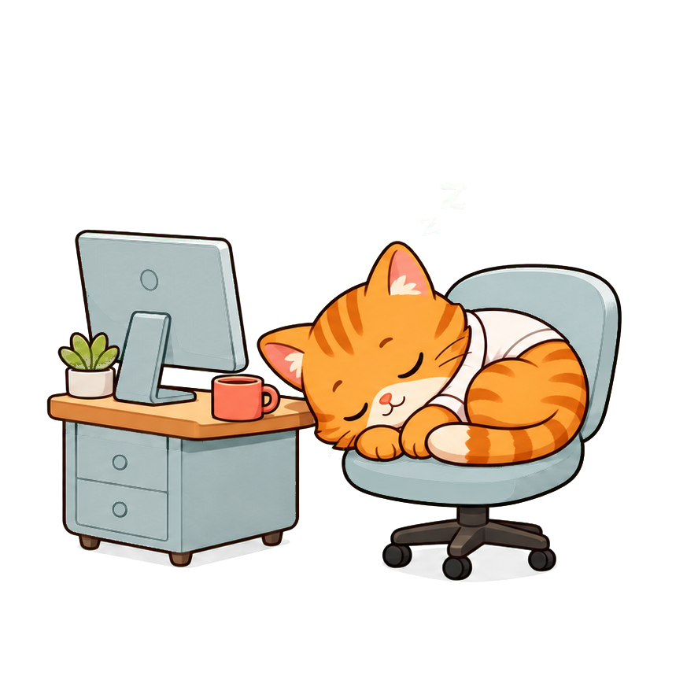
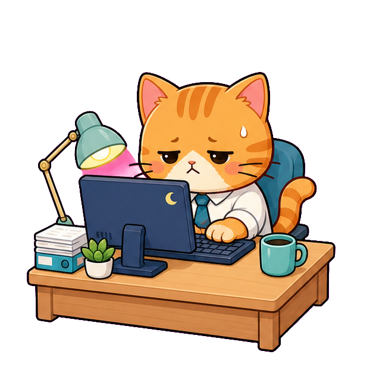
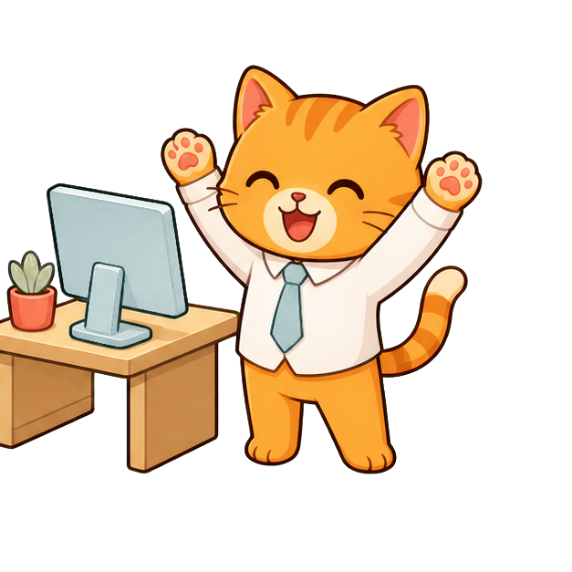

# Workday Pal / 下班搭子

> 一个轻巧、温柔、可自定义的桌面下班计时器。  
> 让有名字的小搭子陪你上班、午休、喝水、加班，然后一起收工。

<p align="center">
  
</p>

<p align="center">
  <strong>桌面悬浮 · 自定义作息 · 宠物装扮 · 喝水提醒 · 加班模式</strong>
</p>

<p align="center">
  <a href="LICENSE"></a>
  
  
</p>

Workday Pal 是一个基于 **Electron** 的跨平台桌面悬浮应用。它不是网页计时器，也不需要额外安装 .NET 运行时；它会安静地待在桌面角落，显示距离午休、下班或加班结束还有多久，并让你的小搭子根据当前状态切换动作。

## 为什么做它

很多下班计时器只是在倒数，但真实的一天并不只有“上班”和“下班”。你可能有午休、喝水提醒、临时加班，也可能只是想让桌面角落多一点温柔的小陪伴。

Workday Pal 想做的是一个克制但可爱的工作日伙伴：小巧、好看、不打扰，但每次看见它，都能知道今天还剩多久。

## 功能亮点

- **首次启动引导**：第一次打开会先设置上班、午休和下班时间
- **自定义作息**：支持编辑上班时间、午休时间、下班时间，并自动保存
- **准确进度条**：只计算实际工作时间，午休不会被算进工作进度
- **桌面搭子**：内置橘子、元宝、糯米、团团、小宇、小满，也支持自定义名字
- **丰富动作**：准备、工作、喝水、玩手机、午睡、加班、下班
- **喝水提醒**：主界面显示下次提醒时间，到点后切换喝水动作
- **加班模式**：支持设置今日加班结束时间，也可以提前结束
- **DIY 装扮**：可以给每种动作导入自己的图片
- **悬浮体验**：置顶、可拖动、可缩放，适合放在桌面角落
- **跨平台**：支持 Windows 和 macOS 打包

## 预览

内置搭子：

| 橘子 | 元宝 | 糯米 | 团团 | 小宇 | 小满 |
| --- | --- | --- | --- | --- | --- |
|  |  |  |  |  |  |

动作状态：

| 工作 | 喝水 | 午睡 | 加班 | 下班 |
| --- | --- | --- | --- | --- |
|  |  |  |  |  |

## 普通用户安装

你可以从 GitHub Actions 或 Release 下载构建产物。

Windows：

- `Workday Pal Setup 1.0.0.exe`：安装版
- `Workday Pal-1.0.0-win.zip`：免安装压缩包

macOS：

- 下载 `.dmg` 后打开，把 `Workday Pal.app` 拖到 `Applications`
- 或下载 `.zip`，解压后运行 `Workday Pal.app`
- 目前 macOS 包还没有 Apple 开发者签名和公证，首次打开可能会提示无法验证开发者。可以在 Finder 中右键应用，选择“打开”，再确认一次

## 本地开发

需要 Node.js 20 或更高版本。

```bash
git clone https://github.com/BuYaoNiLiKai/workday-pal.git
cd workday-pal
npm install
npm start
```

国内网络如果下载 Electron 较慢，可以先设置镜像：

```powershell
$env:ELECTRON_MIRROR="https://npmmirror.com/mirrors/electron/"
$env:ELECTRON_BUILDER_BINARIES_MIRROR="https://npmmirror.com/mirrors/electron-builder-binaries/"
npm install
npm start
```

运行基础校验：

```bash
npm run lint
```

## 打包

Windows：

```bash
npm run build:win
```

macOS：

```bash
npm run build:mac
```

构建产物会输出到 `dist/`。

## 项目结构

```text
workday-pal/
├─ app/                  # 渲染层界面、样式和计时逻辑
├─ electron/             # Electron 主进程和 preload
├─ assets/characters/    # 内置搭子与动作图片
├─ scripts/              # 校验和打包脚本
├─ .github/workflows/    # Windows/macOS 自动构建
├─ package.json
└─ README.md
```

## DIY 素材说明

DIY 搭子需要为 7 种状态分别准备图片：

- 准备：`before-work`
- 工作：`working`
- 喝水：`water`
- 玩手机：`phone`
- 午睡：`sleep`
- 加班：`overtime`
- 下班：`off-work`

建议使用透明背景的方形 PNG，让角色主体居中，并在四周保留一点边距。导入后的图片只会保存到本机应用数据目录，不会上传到网络。

## 路线图

- 增加更多内置搭子和动作
- 支持托盘菜单和开机启动
- 支持自定义提醒文案
- 增加主题配色
- 增加正式应用图标
- 完善 macOS 签名和公证流程

## 参与贡献

欢迎提交 Issue、界面建议、角色素材和 Pull Request。这个项目适合做成一个温柔的小型开源工具：代码保持简单，功能保持克制，但让每天的下班时间多一点期待。

## 许可

本项目使用 [MIT License](LICENSE)。
